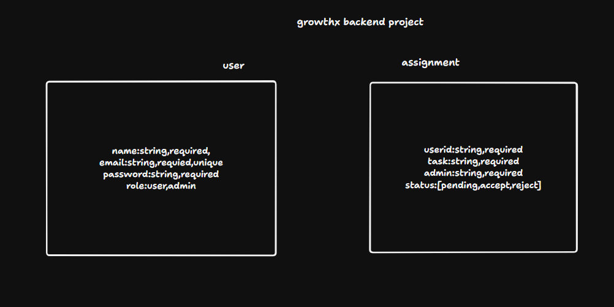
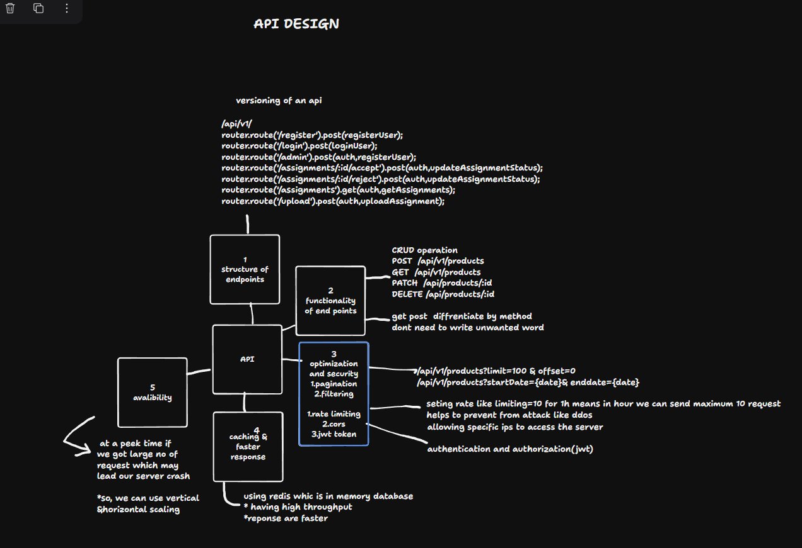

BACKEND(NodeJS ExpressJS MongoDB)
Assignment Submission Portal - Project Documentation
Objective
Develop a backend system for an assignment submission portal that supports Users and Admins. The system allows users to upload assignments and admins to accept or reject those assignments.

---
## Technology Stack

- **Backend Framework:** Node.js with Express.js
- **Database:** MongoDB
- **Language:** JavaScript (TypeScript optional for enhanced typing and maintainability)
- **Authentication:** JSON Web Tokens (JWT)
- **File Upload:** Multer
---
Assignment Submission Portal - Project Documentation
Objective
Develop a backend system for an assignment submission portal that supports Users and Admins. The system allows users to upload assignments and admins to accept or reject those assignments.

Technology Stack
Backend Framework: Node.js with Express.js
Database: MongoDB
Language: JavaScript (TypeScript optional for enhanced typing and maintainability)
Authentication: JSON Web Tokens (JWT)
File Upload: Multer


Features
User Functionality:
User registration and login.
Ability to upload assignments.
Admin Functionality:
Admin registration and login.
View all assignments tagged to them.
Accept or reject assignments with reasons if needed.
 
 setup for this project
 
check node  and npm version
```bash
node -v
npm -v
```
if not shows any version then install it

Initialize the Project: Run the following command to create a package.json file, which manages project dependencies and metadata
```bash
npm init
```

You'll be prompted to provide details such as:
Package name
Version
Description
Entry point (default: index.js)
author

Now first install all the dependicies which are we goind to need

```bash
npm i express
npm i mongoose
npm i cookie-parser
npm i cors
npm i dotenv
npm i bcryptjs
npm i jsonwebtoken
npm i nodemon
```
---
DATABASE SCHEMA


User Schema
```js
import mongoose from "mongoose";
//creating user schema
const userSchema = new mongoose.Schema({
  name: { 
    type: String,
     required: true },
  email: { 
    type: String, 
    required: true, 
    unique: true },
  password: { 
    type: String, 
    required: true 
},
  role: { 
    type: String, 
    enum: ['user', 'admin'], 
    required: true },
},{timestamps: true});

const growthxuser= mongoose.model("growthxuser", userSchema);
export default growthxuser;

```
Assignment Schema
```js
import mongoose from "mongoose";

//creating assignment schema
const assignmentSchema = new mongoose.Schema({
  userId: { 
    type: String, 
    required: true },
  task: { 
    type: String,
     required: true },
  admin: {
     type: String,
     required: true },
  status: {
     type: String, 
    enum: ['pending', 'accept', 'reject'], default: 'pending' },//setting default status as pending and enum as accept and reject
 
},{timestamps: true});//setting timestamps containig created at and updated at value
//creating assignment model
const growthxassignment = mongoose.model("growthxassignment", assignmentSchema);
export default growthxassignment;

```

connect to database for which we need mongoose so check in depedencies if not then install

```js
import mongoose from "mongoose";
//connecting to database
const connectDB = async () => {
    try {    
        const conn = await mongoose.connect(`${process.env.MONGODB_URI}`);
        console.log(`MongoDB Connected: ${conn.connection.host}`);    
    } catch (error) {
        throw error;
    }
    }
   export  {connectDB};

```
CONTROLLER
user controller
```js
import express from "express";
import jwt from "jsonwebtoken";
import bcrypt from "bcryptjs";
import User from "../models/user.model.js";
import Assignment from "../models/assignment.model.js";
import cookieParser from "cookie-parser";

//function to register user and admin
const registerUser = async (req, res) => {
  const { name, email, password, role } = req.body;
  try {
    const hashedPassword = await bcrypt.hash(password, 10);   // Hashing the password with the help of bycrpt
    const user = new User({ name, email, password: hashedPassword, role });//creating new user
    await user.save();//saving user
    res.status(201).json({ message: 'User registered successfully', user });
  } catch (error) {
    res.status(500).json({ error: error.message });
  }
};

//function to login user and admin
const loginUser = async (req, res) => {
  const { email, password } = req.body;  //accessing email and password from request
  try {
    const user = await User.findOne({ email }); //finding user in database
    if (!user) return res.status(404).json({ error: 'User not found' }); //checking user if it is present in database or not

    const isMatch = await bcrypt.compare(password, user.password); //comparing password with hashed password
    if (!isMatch) return res.status(400).json({ error: 'Invalid credentials' });

    const token = jwt.sign({ id: user._id, role: user.role, name: user.name }, process.env.JWT_SECRET, { expiresIn: '1h' }); //creating token by using payload and secret
    res.cookie('token', token, { httpOnly: true, secure: true }); //setting token in cookie
    return res.status(200).json({ token });
  } catch (error) {
   return res.status(500).json({ error: error.message });
  }
};

const uploadAssignment = async (req, res) => {
   const userId = req.user.name; //getting user name from req.user which is set in auth middleware
  const {  task, admin } = req.body; //accessing task and admin from request
  try {
    const assignment = new Assignment({ userId, task, admin });//creating new assignment
    await assignment.save();
    res.status(201).json({ message: 'Assignment uploaded', assignment });
  } catch (error) {
    res.status(500).json({ error: error.message });
  }
};

export { registerUser, loginUser, uploadAssignment };

```
admin controller
```js
import Assignment from "../models/assignment.model.js";

//function to get all assignments of admin
const getAssignments = async (req, res) => {
  const admin = await Assignment.find({ admin:req.user._id }); //finding admin details to gets his name
  try {
    const assignments = await Assignment.find({ admin: req.user.name });//finding assignments mention in the name of admin
    return res.status(200).json(assignments);
  } catch (error) {
    returnres.status(500).json({ error: error.message });
  }
};

//function to update status of assignment
const updateAssignmentStatus = async (req, res) => {
  const path=req.url;   //accessing url
  const status=path.split("/")[3]; //splitting url to find status
  const { id } = req.params;//accessing id of assignment
  try {
    const assignment = await Assignment.findByIdAndUpdate(id, { status: status }, { new: true }); //finding assignment and updating status
   return res.status(200).json({ message: `Assignment ${status}`, assignment });
  } catch (error) {
    return res.status(500).json({ error: error.message });
  }
};

export { getAssignments, updateAssignmentStatus };

```
till now we have completed all the controller and database part

now i have design api endpoints which handle the request and bring controller in action


Image shows the basics of image desigining but in this assignment we dont implement as we dont need it because of smaller server load and small datasize

```js
import express from "express";
import  Router  from "express";
import { registerUser, loginUser, uploadAssignment } from "../controller/user.controller.js";
import { getAssignments ,updateAssignmentStatus} from "../controller/admin.controller.js";
import auth from "../middleware/authmiddleware.js";

//creating routes
const router = Router();
router.route('/register').post(registerUser);
router.route('/login').post(loginUser);
router.route('/admin').post(auth,registerUser);
router.route('/assignments/:id/accept').post(auth,updateAssignmentStatus);
router.route('/assignments/:id/reject').post(auth,updateAssignmentStatus);
router.route('/assignments').get(auth,getAssignments);
router.route('/upload').post(auth,uploadAssignment);
export default router;

```
in above code we can see that apart from controller i have injeacted a funtion name auth

auth is a middleware which is used to verify whether the request is genuine or not. 

//for authroization and authentication i used jsonwebtoken which provide 2 method sign and verify sign:used for generate the token by taking input as (payload,secret key,expires_time) and set it into cookies
verify:it will verify the token by taking input as(token,secret key) and return decoded token

```js
import jwt from 'jsonwebtoken';
import cookieParser from 'cookie-parser';

//middleware for authentication
const auth = (req, res, next) => {

  const token =req.cookies?.token || req.header("Authorization")?.replace("Bearer ","");  //accessing token from cookie
  if (!token) return res.status(401).json({ error: 'No token, authorization denied' }); //checking token

  try {
    const decoded = jwt.verify(token, process.env.JWT_SECRET); //verifying token
    req.user = decoded;  //setting user in req.user with decoded data
    next();
  } catch (error) {
    res.status(400).json({ error: 'Token is not valid' });
  }
};
export default auth;

```
VALIDATION

we need to validate user input so that we can reduce inconsistency in code

```js

//validating data  when user registers
    const validateUserRegistration=(data) => {
      const { name, email, password, role } = data;
  
      if (!name || typeof name !== 'string' || name.trim().length === 0) {
        return { isValid: false, message: 'Name is required and must be a non-empty string.' };       //validating name
      }
  
      if (!email || !/^[^\s@]+@[^\s@]+\.[^\s@]+$/.test(email)) {
        return { isValid: false, message: 'A valid email is required.' };//validating email
      }
  
      if (!password || password.length < 6) {
        return { isValid: false, message: 'Password must be at least 6 characters long.' };   //validating password
      }
  
      if (!role || !['user', 'admin'].includes(role)) {
        return { isValid: false, message: "Role must be either 'user' or 'admin'." };//validating role
      }
  
      return { isValid: true };
    }
  
    const validateUserLogin= (data) => {
      const { email, password } = data;
  
      if (!email || !/^[^\s@]+@[^\s@]+\.[^\s@]+$/.test(email)) {
        return { isValid: false, message: 'A valid email is required.' }; //validating email
      }
  
      if (!password || password.trim().length === 0) {
        return { isValid: false, message: 'Password is required.' }; //validating password
      }
  
      return { isValid: true };
    }

  
    const validateAssignmentUpload =(data) => {
      const { userId, task, admin } = data;
  
      if (!userId || typeof userId !== 'string' || userId.trim().length === 0) {
        return { isValid: false, message: 'User ID is required and must be a non-empty string.' };   //validating user id
      }
  
      if (!task || typeof task !== 'string' || task.trim().length === 0) {
        return { isValid: false, message: 'Task description is required and must be a non-empty string.' };  //validating task
      }
  
      if (!admin || typeof admin !== 'string' || admin.trim().length === 0) {
        return { isValid: false, message: 'Admin ID is required and must be a non-empty string.' };  //validating admin id
      }
  
      return { isValid: true };
    }

  
   const validateAssignmentStatusUpdate= (data) => {
      const { status } = data;
  
      if (!status || !['accepted', 'rejected'].includes(status)) {
        return { isValid: false, message: "Status must be either 'accepted' or 'rejected'." };
      }
  
      return { isValid: true };
    }

    export { validateUserRegistration, validateUserLogin, validateAssignmentUpload, validateAssignmentStatusUpdate };
```

apart from this i have used bcrypt to encrypt the password before saving it on database

here we are using 2 bcrypt method (hash,compare)
hash:for hashing the code
compare;to verify the password


